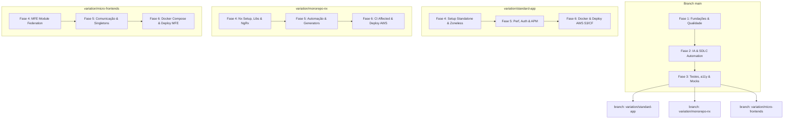

# 🚀 Angular Enterprise Template - Roadmap de Estudos & Evolução

Este documento serve como um guia de estudo e passo a passo prático para transformar este repositório em um template robusto, modular e pronto para produção, seguindo as melhores práticas modernas do ecossistema Angular.

No futuro, este repositório poderá ser utilizado como base (boilerplate) para a inicialização de qualquer novo projeto Angular na organização.

---

## 🗺️ Visão Geral do Roadmap & Estratégia de Branches

Para evitar complexidade desnecessária e manter o projeto focado, adotamos uma estratégia de **bifurcação de branches** após as fases iniciais. As fundações comuns (Fases 1 a 3) são implementadas na branch `main`. A partir da Fase 4, o projeto divide-se em 3 variações arquiteturais distintas:

> [!NOTE]
> **Fluxo de Trabalho de IA Unificado**: Todas as branches adotam o fluxo de desenvolvimento assistido por agentes criado na Fase 2 (criação de issues, geração de SDD, implementação guiada e submissão estruturada de PRs com revisão humana obrigatória antes do merge). Veja mais detalhes em [docs/agentic-sdlc.md](file:///Users/alexandre/Desktop/playground/ng-cookbook/docs/agentic-sdlc.md).

---

## 📅 Detalhamento das Fases

### 🟢 Fase 1: Fundações, Arquitetura & Qualidade de Código (Branch `main`)

- [x] **Linting & Formatting** (ESLint, Prettier, EditorConfig)
- [x] **Git Hooks** (Husky, lint-staged, Commitlint)
- [ ] **Feature-Based Architecture** (Folder Structure, Path Aliases & Boundary Enforcement)

- [ ] **Estilização & Design System** (Variables CSS, HSL Tailwind/Vanilla CSS Tokens)
- [ ] **Developer Experience (DX)** (VS Code Workspace settings, sugestão de extensões recomendadas via `extensions.json` e perfis de debug padrão)
- [ ] **Documentação Visual de Componentes** (Storybook para desenvolvimento isolado de componentes e catálogo visual)
- [ ] **Validação de Schemas & Runtime Checking** (Zod para validação em runtime de respostas de API e schemas complexos de formulários)
- [ ] **Templates de Documentação Técnica** (Estruturação de templates de **ADR** - Architecture Decision Records e **RFC** - Request for Comments na pasta `docs/` para governança de decisões arquiteturais)

---

### 🤖 Fase 2: IA, Agents & Automação de SDLC (Branch `main`)

- [x] **Integração de Agentes e IA**: Definição e automação do ciclo de desenvolvimento assistido por agentes (Issue Creator, SDD Generator, Code Builder e PR Submitter com revisão humana).

_Status: Concluído. Detalhamento completo do fluxo disponível em [docs/agentic-sdlc.md](file:///Users/alexandre/Desktop/playground/ng-cookbook/docs/agentic-sdlc.md)._

---

### 🔴 Fase 3: Estrutura de Testes Automatizados, Acessibilidade (a11y) & Mocks (Branch `main`)

- [ ] **Testes Unitários** (Vitest)
- [ ] **Testes de Componentes / Integração local**
- [ ] **Testes End-to-End (E2E)** (Playwright ou Cypress)
- [ ] **Testes de Acessibilidade (a11y)** (Integração do Axe-core nos testes e validação ARIA)
- [ ] **Políticas de Cobertura (Coverage Thresholds)**
- [ ] **Estratégia de Mocking de APIs** (MSW - Mock Service Worker para desenvolvimento offline e consistência nos testes)

_Status: Pendente de discussão._

---

## 🔀 Bifurcação das Fases (Variações Específicas)

### 📦 Variação A: `variation/standard-app` (Aplicação Standalone Única)

- **Fase 4: Setup Standalone & Zoneless**
  - [ ] Habilitação e testes da aplicação rodando de forma **Zoneless** (sem zone.js).
  - [ ] Definição do State Management local simples usando Signals.
- **Fase 5: Performance, Autenticação & Observabilidade**
  - [ ] Deferrable Views (`@defer`), SSR (Server-Side Rendering) & Hydration.
  - [ ] Internacionalização (i18n / Transloco).
  - [ ] Módulo de Autenticação desacoplado (JWT customizado + MSAL / Google Sign-In).
  - [ ] Integração de Observabilidade (Sentry/LogRocket) e Global Error Handler.
- **Fase 6: Conteinerização, CI/CD & Deploy AWS**
  - [ ] Dockerfile otimizado para build de SPA estática ou SSR único.
  - [ ] Pipeline GitHub Actions (Linter, Testes, Build).
  - [ ] Deploy AWS (S3 + CloudFront para SPA ou App Runner para SSR).

---

### 🏛️ Variação B: `variation/monorepo-nx` (Monorepo com Nx)

- **Fase 4: Nx Setup, Libs & NgRx**
  - [ ] Migração do projeto para um Nx Workspace.
  - [ ] Divisão tática de bibliotecas (`feature`, `ui`, `data-access`, `util`).
  - [ ] Boundary Rules (`nx-enforce-module-boundaries`).
  - [ ] Gerenciamento de Estado com NgRx (NgRx Store/Effects + NgRx Signal Store).
- **Fase 5: Automação, Storybook & Generators**
  - [ ] Storybook integrado a nível de bibliotecas compartilhadas de UI.
  - [ ] Criação de Nx Generators locais para scaffolding automático de novas libs/features.
- **Fase 6: CI/CD com Affected, Docker & Deploy AWS**
  - [ ] Docker Compose do workspace para desenvolvimento local.
  - [ ] CI/CD no GitHub Actions usando `nx affected` para processar apenas projetos modificados.
  - [ ] Deploy na AWS de aplicações afetadas.

---

### 🌐 Variação C: `variation/micro-frontends` (Micro Frontends - MFE)

- **Fase 4: MFE Module Federation**
  - [ ] Setup do Module Federation para Host/Shell e Remotes.
  - [ ] Runtime Dynamic Integration (carregamento dinâmico de remotes sem re-build).
- **Fase 5: Comunicação, Shared State & Singletons**
  - [ ] Estratégia de compartilhamento de dependências singleton do Angular.
  - [ ] Comunicação inter-MFE usando Event Bus ou Shared State.
  - [ ] Módulo de Autenticação centralizado compartilhado entre MFEs.
- **Fase 6: Docker Compose & Deploy MFE na AWS**
  - [ ] Docker Compose completo para rodar a malha de MFEs localmente.
  - [ ] CI/CD com deploys independentes por MFE.
  - [ ] Deploy na AWS com buckets S3 e distribuições CloudFront isolados por remote.

---

## 🛠️ Como Iniciar

1. Comece alinhando os objetivos da **Fase 1** na branch `main`.
2. Conforme discutirmos cada tópico, avançaremos na implementação passo a passo.
