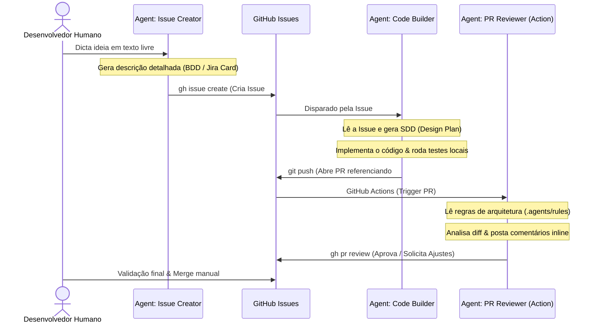

# 🤖 Agentic SDLC - Blueprint de Automação do Ciclo de Desenvolvimento

Este documento descreve o fluxo de trabalho de desenvolvimento ponta a ponta assistido por agentes de Inteligência Artificial que pretendemos implementar na **Fase 2** deste projeto template. 

O objetivo é automatizar tarefas repetitivas de planejamento, escrita de código, versionamento e revisão, garantindo consistência técnica em todas as variações arquiteturais.

---

## 🔄 Visão Geral do Fluxo Automatizado

O ciclo de vida de uma demanda é orquestrado por agentes trabalhando de forma cooperativa com o desenvolvedor humano:



---

## 🧩 Componentes do Fluxo de Automação

### 1. Criador de Demanda (GitHub Issue Creator)
*   **Tipo:** Custom Skill (`.agents/skills/create-issue`)
*   **Descrição:** O desenvolvedor insere um prompt curto informando o objetivo do recurso. A IA consome esse prompt e redige um escopo completo no formato de "Card do Jira" com:
    *   **User Story** (Como [Persona], eu quero [Funcionalidade], para que [Valor]).
    *   **Critérios de Aceitação** (Formato Gherkin: *Given-When-Then*).
    *   **Notas Técnicas sugeridas** (Camadas do Angular a serem tocadas).
*   **Resultado:** Criação automatizada de uma issue no GitHub usando a CLI (`gh issue create`).

### 2. Gerador de Design Técnico (SDD Planner)
*   **Tipo:** Custom Skill (`.agents/skills/implement-issue`)
*   **Descrição:** Ao iniciar o desenvolvimento, o agente lê a issue criada, analisa a base de código atual e elabora um **Software Design Document (SDD)**.
    *   Mapeia arquivos que serão criados (`[NEW]`), modificados (`[MODIFY]`) ou removidos (`[DELETE]`).
    *   Gera um arquivo de checklist de tarefas local (`task.md`) para guiar a codificação passo a passo.
*   **Resultado:** Um plano arquitetural revisado antes do início da escrita do código.

### 3. Agente de Implementação & Commit
*   **Tipo:** Workspace Agent (Utilizando as regras locais do repositório)
*   **Descrição:** Executa a codificação iterativamente a partir do `task.md`. Ao finalizar:
    *   Executa os testes locais (`ng test` ou `vitest`).
    *   Se os testes passarem, realiza o commit e push automáticos, amarrando a mensagem de commit ao ID da issue original (ex: `feat: auth module integration #42`).
*   **Resultado:** Pull Request aberta com código testado e referenciado.

### 4. Revisor Automático de PR (Antigravity SDK & GitHub Actions)
*   **Tipo:** Custom Agent scriptado com o **Antigravity SDK** rodando no CI/CD.
*   **Descrição:** Executado como um workflow no GitHub Actions a cada abertura ou atualização de Pull Request.
    *   **Leitura de Regras:** Consome `.agents/rules/*` e `docs/architecture.md` para entender as diretrizes de código.
    *   **Revisão Estrita:** Analisa o *diff* do código em busca de violações (ex: importações circulares, componentes não standalone, falta de tipagem Zod, ou falta de testes).
    *   **Comentários Inline:** Posta feedbacks diretamente nas linhas da PR no GitHub.
    *   **Aprovação:** Se o código seguir 100% das diretrizes e os testes do CI passarem, o agente adiciona um selo de aprovação técnica.
*   **Resultado:** PR higienizada e avaliada antes da revisão final do desenvolvedor humano.

---

## 📂 Estrutura de Pastas de IA (`.agents/`)

Para habilitar esse fluxo, o repositório manterá a seguinte estrutura de configuração para os agentes inteligentes:

```text
.agents/
├── rules/
│   ├── architecture-rules.md     # Instruções de estrutura feature-based para a IA
│   ├── coding-style-rules.md     # Regras de Signals, Standalone e CSS variables
│   └── testing-rules.md          # Padrões de Vitest, MSW e Playwright
│
└── skills/
    ├── create-issue/             # Prompts e templates para geração de cards de demanda
    ├── generate-sdd/             # Engenharia de prompt para planejar modificações de arquivos
    └── review-pr/                # Script do Antigravity SDK para revisão e feedback automatizado
```

---

## 🚀 Benefícios do Flow para Todas as Branches

Como este fluxo de automação é configurado na **Fase 2** na branch `main`, todas as três variações arquiteturais (`variation/standard-app`, `variation/monorepo-nx` e `variation/micro-frontends`) herdarão esses agentes. 

Isso significa que, independentemente da arquitetura escolhida, os times utilizarão a mesma esteira profissional de desenvolvimento assistido por IA.
