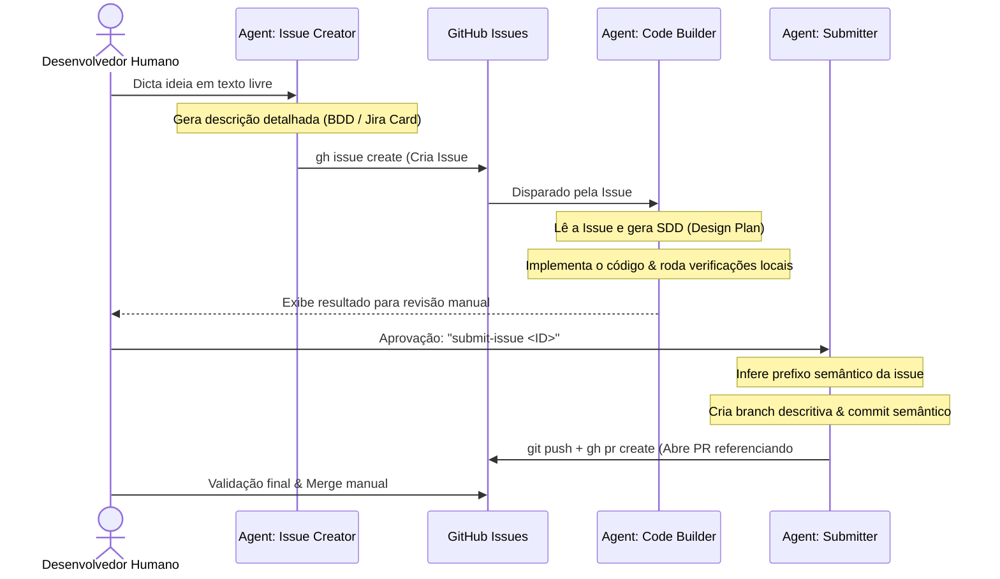

# 🤖 Agentic SDLC - Blueprint de Automação do Ciclo de Desenvolvimento

Este documento descreve o fluxo de trabalho de desenvolvimento ponta a ponta assistido por agentes de Inteligência Artificial que pretendemos implementar na **Fase 2** deste projeto template.

O objetivo é automatizar tarefas repetitivas de planejamento, escrita de código, versionamento e revisão, garantindo consistência técnica em todas as variações arquiteturais.

---

## 🔄 Visão Geral do Fluxo Automatizado

O ciclo de vida de uma demanda é orquestrado por agentes trabalhando de forma cooperativa com o desenvolvedor humano:



---

## 🧩 Componentes do Fluxo de Automação

### 1. Criador de Demanda (GitHub Issue Creator)

- **Tipo:** Custom Skill (`.agents/skills/create-issue`)
- **Descrição:** O desenvolvedor insere um prompt curto informando o objetivo do recurso. A IA consome esse prompt e redige um escopo completo no formato de "Card do Jira" com:
  - **User Story** (Como [Persona], eu quero [Funcionalidade], para que [Valor]).
  - **Critérios de Aceitação** (Formato Gherkin: _Given-When-Then_).
  - **Notas Técnicas sugeridas** (Camadas do Angular a serem tocadas).
- **Resultado:** Criação automatizada de uma issue no GitHub usando a CLI (`gh issue create`).

### 2. Gerador de Design Técnico (SDD Planner)

- **Tipo:** Custom Skill (`.agents/skills/implement-issue`)
- **Descrição:** Ao iniciar o desenvolvimento, o agente lê a issue criada, analisa a base de código atual e elabora um **Software Design Document (SDD)**.
  - Mapeia arquivos que serão criados (`[NEW]`), modificados (`[MODIFY]`) ou removidos (`[DELETE]`).
  - Gera um arquivo de checklist de tarefas local (`temp_task.md`) na raiz do workspace para guiar a codificação passo a passo.
  - **Nota de Ciclo de Vida**: Tanto o checklist (`temp_task.md`) quanto o SDD (`.agents/sdd/sdd-issue-<ID>.md`) são ferramentas de controle estritamente locais/temporárias durante a sessão ativa de codificação. Eles são adicionados ao `.gitignore` do repositório para evitar o envio acidental ao repositório remoto.
- **Resultado:** Um plano arquitetural revisado localmente antes do início da escrita do código.

### 3. Agente de Implementação & Commit

- **Tipo:** Workspace Agent (Utilizando as regras locais do repositório)
- **Descrição:** Executa a codificação iterativamente a partir do `temp_task.md`. Ao finalizar:
  - Executa as verificações locais (`npm run lint`, `npm run format`).
  - Apresenta o resultado ao desenvolvedor para **revisão manual** antes de prosseguir.
  - Deleta o arquivo `/temp_task.md` local como etapa de limpeza da tarefa (clean-up).
- **Resultado:** Código revisado e aprovado pelo desenvolvedor antes do commit.

### 4. Submissão & Pull Request (Submit Skill)

- **Tipo:** Custom Skill (`.agents/skills/submit-issue`)
- **Descrição:** Após aprovação humana, o agente gerencia o versionamento completo:
  - Infere o **prefixo semântico** correto (`feat`, `fix`, `chore`, `refactor`, etc.) a partir do contexto da issue.
  - Cria uma **branch descritiva** em kebab-case (ex: `chore/setup-linting-and-formatting`).
  - Cria o commit semântico e faz o push para o remoto via HTTPS autenticado.
  - Abre uma **Pull Request estruturada** no GitHub com sumário de mudanças e evidências de verificação.
  - Deleta o arquivo temporário do SDD local como etapa final de limpeza do workspace (o SDD serve apenas como guia de apoio para o desenvolvedor durante o ciclo).
- **Resultado:** PR aberta com código testado, referenciado e documentado, mantendo a PR limpa e livre de artefatos de planejamento temporários.

> [!NOTE]
> **Sobre Revisão Automatizada de PRs**: A automação da revisão de código via CI/CD foi avaliada e, por questões de soberania de dados (código não deve ser enviado a provedores de IA de terceiros sem contrato estabelecido) e custo operacional, optou-se pela **revisão humana** como etapa obrigatória do fluxo. Ferramentas como GitHub Copilot Enterprise ou Gemini Code Assist Enterprise são as alternativas viáveis para projetos profissionais que exijam essa automação com garantias contratuais.

---

## 📂 Estrutura de Pastas de IA (`.agents/`)

Para habilitar esse fluxo, o repositório manterá a seguinte estrutura de configuração para os agentes inteligentes:

```text
.agents/
├── rules/
│   ├── architecture-rules.md     # Instruções de estrutura feature-based para a IA
│   ├── coding-style-rules.md     # Regras de Signals, Standalone e CSS variables
│   └── testing-rules.md          # Padrões de Vitest, MSW e Playwright
│
└── skills/
    ├── create-github-issue/      # Prompts e templates para geração de cards de demanda
    ├── generate-sdd/             # Engenharia de prompt para planejar modificações de arquivos
    ├── implement-issue/          # Orquestra planejamento e implementação a partir de uma issue
    └── submit-issue/             # Commit semântico, branch descritiva e abertura de PR estruturada
```

---

## 🚀 Benefícios do Flow para Todas as Branches

Como este fluxo de automação é configurado na **Fase 2** na branch `main`, todas as três variações arquiteturais (`variation/standard-app`, `variation/monorepo-nx` e `variation/micro-frontends`) herdarão esses agentes.

Isso significa que, independentemente da arquitetura escolhida, os times utilizarão a mesma esteira profissional de desenvolvimento assistido por IA.
