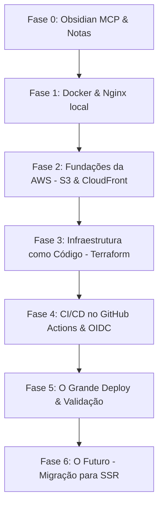

# 🗺️ Roteiro de Estudos: Conteinerização, IaC e Deploy na AWS

Este documento serve como guia de aprendizado passo a passo para o primeiro deploy em produção de um projeto solo utilizando Angular (versão SPA), Docker, Terraform, GitHub Actions e AWS (S3 + CloudFront).

---

## 🗺️ Visão Geral do Roadmap

---

## 📓 Fase 0: Conectando o Obsidian (MCP)

Antes de iniciar a infraestrutura, conectamos nossa inteligência de desenvolvimento ao seu cofre de notas pessoal do Obsidian para registrar resumos de estudo de cada etapa.

### O que estudar/configurar:

- **Obsidian Local REST API**: Plugin de comunidade no Obsidian que expõe uma porta HTTPS local segura (padrão: `27124`).

- **Obsidian MCP (`mcp-obsidian`)**: Como o Antigravity utiliza o protocolo MCP para interagir com o seu vault de forma segura.

- **Fluxo de Trabalho**: Criar uma pasta `/Estudos-Deploy` em seu cofre e documentar cada aprendizado prático.

---

## 🐳 Fase 1: Docker & Nginx na Prática (Empacotamento)

Entender como isolar e preparar a aplicação para rodar de forma idêntica em qualquer ambiente do mundo.

### O que estudar/configurar:

- **O que é um Container**: Isolamento a nível de processo vs Máquinas Virtuais pesadas.

- **Pilares do Docker**:

- `Dockerfile`: A receita do ambiente.

- `Imagem`: O pacote binário estático e imutável gerado após compilação.

- `Container`: O processo vivo em execução.

- **Multi-stage Build**:

- **Stage 1 (Node.js)**: Instalação e compilação do Angular (`ng build`).

- **Stage 2 (Nginx)**: Imagem ultra leve do servidor Nginx servindo a pasta `dist/` gerada, descartando dependências de desenvolvimento.

- **Nginx para SPA (Single Page Application)**:

- Configuração da diretiva `try_files $uri $uri/ /index.html` para redirecionar rotas internas do Angular ao index.html e evitar erros 404 ao atualizar a página.

- Configuração de Gzip para compactação de arquivos textuais (JS, CSS, HTML).

- Cabeçalhos de cache otimizados (`Cache-Control`) para assets com hash único.

---

## ☁️ Fase 2: Fundações da AWS (S3 & CloudFront)

Compreender como desenhar uma infraestrutura resiliente, barata e performática de distribuição de conteúdo estático.

### O que estudar/configurar:

- **IAM (Identity and Access Management)**: Princípio do privilégio mínimo, criação de funções (Roles) e permissões de acesso.

- **Amazon S3**: Buckets para armazenamento de arquivos e segurança de acesso privado.

- **Amazon CloudFront (CDN)**:

- Cache geodistribuído em Edge Locations.

- **OAC (Origin Access Control)**: Restrição de acesso ao S3 para que somente o CloudFront consiga ler os arquivos estáticos.

- Regras de roteamento de erros (mapear erro 403/404 vindo do S3 privado de volta para `index.html` com status 200).

- **DNS & Certificados SSL**: Utilização do AWS Certificate Manager (ACM) para HTTPS gratuito e mapeamento de domínio personalizado.

---

## 🏗️ Fase 3: Infraestrutura como Código (Terraform)

Gerenciar todos os seus recursos de nuvem através de arquivos de texto versionáveis (IaC), evitando erros manuais no console da AWS.

### O que estudar/configurar:

- **Terraform basics**: Provedores (Providers), Recursos (Resources), Variáveis (Variables) e Outputs na linguagem HCL.

- **Gerenciamento do Estado (`.tfstate`)**: O que é o arquivo de controle que mapeia seu código à realidade da nuvem AWS, e como mantê-lo seguro.

- **Mapeamento de Recursos**: Escrever em código a declaração do bucket S3, da distribuição do CloudFront, das políticas do IAM e chaves de acesso do OAC.

---

## 🤖 Fase 4: Automação e CI/CD (GitHub Actions & OIDC)

Construir a pipeline que valida a integridade do seu código e publica na AWS automaticamente.

### O que estudar/configurar:

- **Workflows no GitHub Actions**: Estrutura de arquivos YAML contendo triggers (push, PR), Jobs, Steps e Runners.

- **Caching da Pipeline**: Salvando e restaurando a pasta `node_modules` e o cache de compilação do Angular para deploys de poucos segundos.

- **OIDC (OpenID Connect)**: Autenticação segura sem armazenar chaves de API permanentes da AWS nos Secrets do GitHub. A pipeline solicita credenciais temporárias válidas por apenas alguns minutos.

- **Workflow de Deploy**: Passos para rodar linter, testes unitários, build e sincronização com o S3 + invalidação do cache no CloudFront.

---

## 🚀 Fase 5: O Deploy de Produção & Validação

O fluxo operacional prático para colocar o site no ar e inspecionar sua saúde.

### O que estudar/configurar:

- **Provisionamento com Terraform**: Execução do `terraform apply` inicial.

- **Deploy via Git Push**: Enviar o código para o repositório remoto e observar a execução dos testes e a publicação do site.

- **Validação de Produção**:

- Inspecionar cabeçalhos de resposta HTTP (Headers) no DevTools do navegador.

- Testar rotas diretas (F5 no navegador) para validar a configuração de SPA no Nginx/CloudFront.

- Testar compressão Gzip.

- **Estratégias de Rollback**: Como retornar instantaneamente para uma versão estável em caso de falhas.

---

## 🔄 Fase 6: O Futuro (SSR com App Runner)

O plano de evolução arquitetural quando a aplicação requerer Server-Side Rendering (SSR).

### O que estudar/configurar:

- **Modificações no Dockerfile**: Substituição do Nginx pelo runtime do Node.js executando o servidor do Angular SSR.

- **AWS ECR (Elastic Container Registry)**: Armazenamento da imagem Docker compilada.

- **AWS App Runner**: Serviço serverless gerenciado para execução do container Node.js, com auto-scaling e HTTPS integrados de fábrica.

- **Estrutura de Origem Híbrida no CloudFront**: CloudFront apontando caminhos `/browser` para o S3 e caminhos dinâmicos de renderização para o App Runner.
