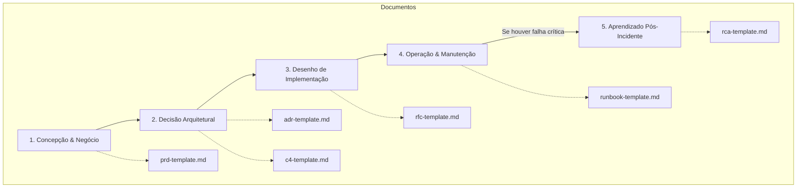

# Guia de Templates de Engenharia e Produto

Este diretório contém os templates padronizados para guiar o ciclo de vida de desenvolvimento de software (SDLC) da equipe. Abaixo está a explicação de quando e como utilizar cada um desses documentos.

---

## 1. Ciclo de Vida do Desenvolvimento (SDLC)

O fluxo de documentação acompanha a evolução de uma iniciativa, desde a ideia de negócio até a operação em produção:

---

## 2. Quando usar cada Template?

### 📄 [PRD (Product Requirement Document)](file:///Users/alexandre/Desktop/playground/ng-cookbook/docs/templates/prd-template.md)

- **Fase:** Concepção & Alinhamento de Escopo.
- **Quem escreve:** Product Manager (PM) / Product Owner (PO).
- **Quando usar:** Antes de escrever qualquer linha de código ou design de arquitetura. Use para definir **o que** está sendo construído, **para quem** (personas), **quais as regras de negócio** e **como mediremos o sucesso** (KPIs).
- **Foco:** Linguagem de produto e de negócio (sem detalhes técnicos de banco de dados ou código).

### 📐 [ADR (Architecture Decision Record)](file:///Users/alexandre/Desktop/playground/ng-cookbook/docs/templates/adr-template.md)

- **Fase:** Planejamento Tecnológico Macro.
- **Quem escreve:** Tech Lead / Arquitetos de Software / Engenheiros Sênior.
- **Quando usar:** Quando uma decisão técnica significativa com impacto de longo prazo é tomada (ex: migrar de banco de dados relacional para NoSQL, adotar um novo framework, mudar o padrão de autenticação).
- **Foco:** Contexto, alternativas avaliadas, consequências e o motivo da decisão tomada. Serve como registro histórico ("diário") da evolução arquitetural do sistema.

### 🗺️ [C4 Model](file:///Users/alexandre/Desktop/playground/ng-cookbook/docs/templates/c4-template.md)

- **Fase:** Documentação de Arquitetura.
- **Quem escreve:** Time de Engenharia.
- **Quando usar:** Para desenhar diagramas que explicam a estrutura física e lógica do software em diferentes níveis de zoom (Contexto, Containers, Componentes).
- **Foco:** Visualização técnica do ecossistema para facilitar o onboarding de devs e discussões de arquitetura.

### 📝 [RFC (Request for Comments)](file:///Users/alexandre/Desktop/playground/ng-cookbook/docs/templates/rfc-template.md)

- **Fase:** Desenho de Implementação Técnica.
- **Quem escreve:** Engenheiro(s) responsável(is) por implementar a funcionalidade do PRD.
- **Quando usar:** Quando a especificação do PRD é repassada para a engenharia. A RFC detalha **como** o software será implementado (schemas de banco, endpoints, fluxos de código) para colher comentários e validações técnicas do time antes do início do desenvolvimento.
- **Foco:** Detalhes de implementação, alternativas consideradas e trade-offs técnicos.

### 📖 [Runbook](file:///Users/alexandre/Desktop/playground/ng-cookbook/docs/templates/runbook-template.md)

- **Fase:** Operação & Sustentação (Produção).
- **Quem escreve:** Time de engenharia mantenedor do serviço ou SRE.
- **Quando usar:** Quando um novo serviço ou aplicação vai para produção. Deve conter os links de APM/logs e o passo a passo para resolução de dúvidas comuns do suporte e triagem rápida de incidentes (SEV-1/2/3).
- **Foco:** Ações rápidas, acessos necessários, onboarding técnico do serviço e escalação.

### 🕵️ [RCA (Root Cause Analysis)](file:///Users/alexandre/Desktop/playground/ng-cookbook/docs/templates/rca-template.md)

- **Fase:** Pós-Incidente.
- **Quem escreve:** Engenheiros envolvidos no incidente e líderes técnicos.
- **Quando usar:** Após a resolução de um incidente de produção grave (geralmente SEV-1 ou SEV-2). Serve para mapear a linha do tempo do problema, diagnosticar por que as defesas falharam (técnicas ou operacionais) e criar tarefas preventivas.
- **Foco:** Melhoria contínua, sem atribuição de culpa (_blameless postmortem_).

---

## 3. Resumo Rápido

| Documento    | Pergunta Principal                                      | Principal Leitor                                    |
| :----------- | :------------------------------------------------------ | :-------------------------------------------------- |
| **PRD**      | _O que e por que estamos construindo?_                  | Stakeholders, Designers, Engenharia                 |
| **ADR**      | _Por que escolhemos a Tecnologia A e não a B?_          | Engenheiros atuais e futuros                        |
| **C4 Model** | _Como as peças do sistema se conectam?_                 | Todo o time de tecnologia                           |
| **RFC**      | _Como faremos a implementação técnica desse requisito?_ | Time de Engenharia (Revisores)                      |
| **Runbook**  | _Como operar este serviço e triar problemas?_           | Desenvolvedores On-Call, Novos Contratados, Suporte |
| **RCA**      | _Por que o sistema falhou e como evitar que se repita?_ | Diretoria de Engenharia, Equipe técnica             |
