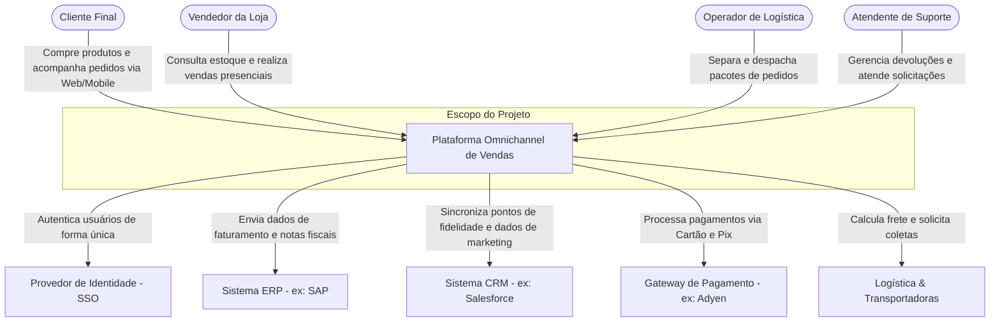
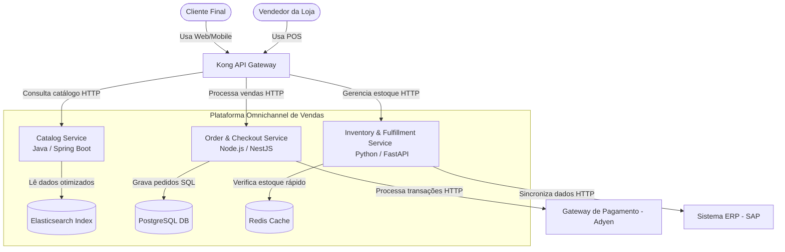
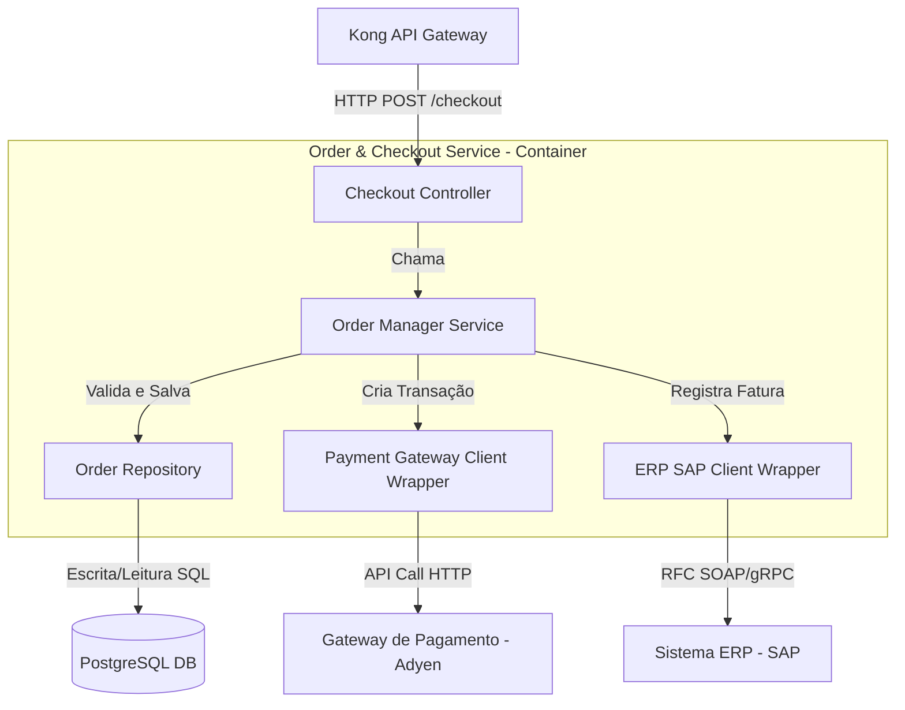

# Guia e Template de Modelo C4 (C4 Model)

Este documento descreve como representar visualmente e textualmente a arquitetura deste projeto utilizando a metodologia **C4 Model** (Context, Containers, Components, Code).

> [!TIP]
> **Recomendação de Uso Prático (Regra 80/20):**
> Para a grande maioria dos times, **recomenda-se projetar e manter atualizados apenas os Níveis 1 e 2**. Os diagramas de Nível 1 (Contexto) e Nível 2 (Containers) são estáveis, exigem baixa manutenção e fornecem cerca de 80% do valor necessário para onboardings e alinhamento técnico entre infraestrutura, segurança e produto. Os Níveis 3 e 4 mudam constantemente à medida que novos arquivos e classes são criados. Por isso, só devem ser criados sob demanda para partes extremamente complexas do sistema ou gerados automaticamente por ferramentas integradas à pipeline.

---

## Nível 1: Diagrama de Contexto do Sistema (System Context)

_O nível de Contexto mostra o sistema como uma caixa preta e foca em como os atores (usuários) e outros sistemas interagem com ele._



### Detalhamento do Contexto

- **Atores (Usuários):**
  - **Cliente Final:** Interage com a plataforma por meio de navegadores web e dispositivos móveis para navegar pelo catálogo, comprar produtos e acompanhar a entrega.
  - **Vendedor da Loja:** Utiliza o sistema integrado de ponto de venda (POS) para consultar o estoque físico consolidado e realizar vendas assistidas.
  - **Operador de Logística:** Acessa o painel de atendimento a pedidos (fulfillment) para gerenciar a triagem, separação (picking), embalagem (packing) e envio dos produtos.
  - **Atendente de Suporte:** Acessa a central de ajuda integrada para consultar históricos de compras, processar reembolsos e resolver disputas.
- **Sistemas Externos:**
  - **Provedor de Identidade (Auth0 / Okta):** Serviço gerenciado para autenticação segura e Single Sign-On (SSO) de funcionários e clientes.
  - **Sistema ERP (SAP):** Sistema de registro corporativo usado para faturamento, emissão de Notas Fiscais (NF-e) e consolidação fiscal e contábil.
  - **Sistema CRM (Salesforce):** Repositório de perfis de clientes para o programa de pontos/fidelidade e campanhas de marketing automatizadas.
  - **Gateway de Pagamento (Adyen / Stripe):** Processa com segurança transações de cartão de crédito, boletos e PIX, além de gerenciar antifraude.
  - **Logística & Transportadoras (Loggi / Correios):** Serviços externos que calculam o valor do frete em tempo real e fornecem o rastreamento dos pacotes.

---

## Nível 2: Diagrama de Containers (Containers)

_O nível de Containers expande o sistema central para mostrar suas partes executáveis individuais (aplicações frontend, microsserviços backend, bancos de dados, cache) e a tecnologia de cada um._



### Detalhamento dos Containers

- **Kong API Gateway:** Ponto único de entrada para todas as requisições dos clientes. Trata roteamento, rate limiting e terminação SSL.
- **Catalog Service (Java):** Microsserviço responsável pela exibição rápida de produtos e busca facetada. Alimenta-se do Elasticsearch.
- **Order & Checkout Service (Node.js):** Responsável por validar carrinhos de compras, gerenciar estados de pedidos e transacionar pagamentos.
- **Inventory & Fulfillment Service (Python):** Controla o estoque unificado físico e digital, além do processo de picking e packing nas lojas e armazéns.
- **Databases & Caches:**
  - _Elasticsearch Index:_ Armazena dados de produtos desnormalizados para busca rápida.
  - _PostgreSQL DB:_ Banco relacional ACID para persistência de dados de pedidos e notas fiscais.
  - _Redis Cache:_ Cache em memória para o inventário de alta frequência de leitura e sessões de usuários.

---

## Nível 3: Diagrama de Componentes (Components)

_O nível de Componentes detalha a organização interna e o fluxo de classes/módulos de um único container (no exemplo abaixo, o **Order & Checkout Service**)._



### Detalhamento dos Componentes do Container

- **Checkout Controller:** Endpoint HTTP que valida a carga útil (payload) de entrada das requisições e gerencia códigos de status HTTP (200, 400, 500).
- **Order Manager Service:** Componente central que coordena a lógica de negócios da transação de checkout (criação do pedido, fluxo de pagamento e faturamento no ERP).
- **Order Repository:** Abstrai o acesso a dados para ler/escrever pedidos no banco de dados PostgreSQL.
- **Payment Client / ERP Client:** Componentes responsáveis por envelopar a comunicação HTTP/gRPC com serviços terceiros (Adyen e SAP), realizando retentativas (retries) e tratamento de erros específicos.

---

## Nível 4: Código (Code)

_O nível de Código mapeia a implementação exata (classes, interfaces, tabelas). No exemplo da nossa Plataforma Omnichannel, este nível seria representado pelo código-fonte real que implementa o fluxo desenhado no Nível 3._

### Exemplo conceitual da Interface e Modelagem do Pedido:

```typescript
// src/app/features/checkout/interfaces/order.interface.ts
export interface Order {
  id: string;
  customerId: string;
  items: OrderItem[];
  totalAmount: number;
  status: 'PENDING' | 'PAID' | 'FAILED';
  createdAt: Date;
}

export interface OrderItem {
  productId: string;
  quantity: number;
  unitPrice: number;
}
```

E no banco de dados SQL (`OrderDB`), o esquema físico da tabela:

```sql
CREATE TABLE orders (
    id VARCHAR(36) PRIMARY KEY,
    customer_id VARCHAR(36) NOT NULL,
    total_amount DECIMAL(10, 2) NOT NULL,
    status VARCHAR(20) NOT NULL,
    created_at TIMESTAMP NOT NULL DEFAULT CURRENT_TIMESTAMP
);
```

> [!NOTE]
> Evite documentar o Nível 4 manualmente, pois ele se torna obsoleto imediatamente após alterações de código. Use geradores automáticos a partir do código-fonte ou utilize-os apenas em documentações pontuais de padrões de design.
